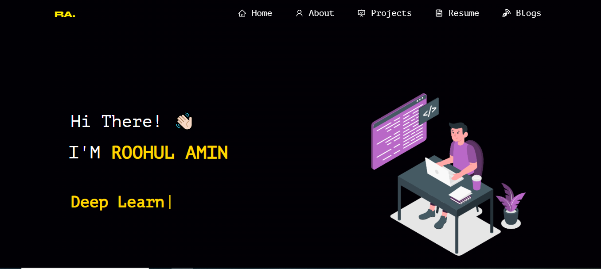

# 🌟 Premium Black & Gold Developer Portfolio

[](https://roohulamin.vercel.app)

---


Welcome to my personal portfolio repository! Built using **React.js**, styled via custom structured CSS, and optimized for high-performance deployment on Vercel. 

This project features a high-end, premium **Black, Charcoal, and Gold** aesthetic designed to display software engineering capabilities, projects, and technical proficiencies in a highly professional wrapper.

▶️ **[View Live Demo](https://roohulamin.vercel.app)** 
</br> 
*(Click on above link to visit the live preview)*

---

## ✨ Features

- **Premium UI Theme:**
</br>
 A custom-engineered, matte-black aesthetic accented with high-vibrancy, YouTube-thumbnail-style golden highlights.
- **Visual Hierarchy:**
<br>
 Distinct readability typography scale transitioning from stark white headers to soft-silver paragraphs.
- **Dynamic Background:**
<br> 
Interactive canvas tracking elements powered by lightweight particle animations.
- **Fully Responsive:**
<br>
 Gracefully scales across high-resolution desktop configurations down to compact smartphone monitors.
- **Performance Optimized:** 
<br>
Fast server responses, lazy-loaded components, and automated CI/CD deployments through Vercel.

---

## 🛠️ Tech Stack & Architecture

- **Frontend Core:**
<br>
 React.js / JavaScript (ES6+)
- **Styling Paradigm:** 
<br>
Global modular CSS cascading logic + responsive media wrappers
- **Interactions:** React 
<br>
Particle Canvas / Typewriter Effects
- **Hosting Pipeline:** 
<br>
Vercel Automated Edge Network

---

## 🚀 Local Installation & Configuration


If you want to run this application locally on your machine or configure your own text properties, execute these terminal commands:

### 1. Clone & Setup Dependencies
```bash
# Clone the repository
git clone https://github.com\


# Navigate into the project folder
cd YOUR_REPO_NAME

# Install essential project modules
npm install
```

### 2. Run the Development Server
```bash
npm start
```
Open [http://localhost:3000](http://localhost:3000) inside your web browser to view your live modifications locally.

### 3. Personalizing Content
- **Global Theme & Accents:** Modify `src/style.css` to update base variables.
- **Webpage Search Title:** Open `public/index.html` and edit the text inside the `<title>` tag.
- **Text & Bio Content:** Head over to the components directory (`src/components/`) to swap placeholders with your career background and upcoming project notes.

---

## 🤝 Contributing & Open Source

This repository is completely open-source! If you find bugs, want to optimize performance, or adapt this layout for your own development workspace, feel free to dive in.

1. **Fork** the Repository.
2. Create your Feature Branch (`git checkout -b feature/AmazingFeature`).
3. **Commit** your Changes (`git commit -m 'Add some AmazingFeature'`).
4. **Push** to the Branch (`git push origin feature/AmazingFeature`).
5. Open a **Pull Request**.

---

## 📄 License

Distributed under the **MIT License**. Look over the `LICENSE` file in the root directory for absolute legal parameters.
